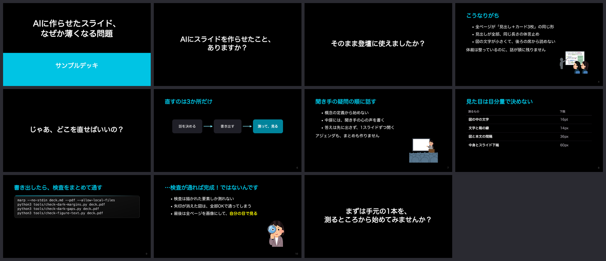

# minorun-marp-skill

登壇スライドを Marp で作るときの、ストーリー・図・デザインバランスの型をまとめたものです。AIエージェント（Claude Code など）に読ませるスキルの形にしてあり、人が読んでもそのまま使えます。

AIにスライドを書かせると、体裁は整うのに話が薄くなりがちです。作者（[@minorun365](https://x.com/minorun365)）が自分の登壇資料を作るなかで、エージェントへ繰り返し伝えてきた直し方を、規則と検査スクリプトに落としました。



## 中身

| 場所 | 内容 |
|---|---|
| `skills/slide-story` | つかみ、中扉、段階的な開示、見出しの文体、締め方、尺の見積り |
| `skills/slide-figures` | 図の情報量の絞り方、SVGの描き方、文字サイズの下限、挿絵の置き方 |
| `skills/slide-design-dark` | 余白の測り方、縦のバランス、黒地の配色、表とコードのデザイン、Marpの罠 |
| `theme/minorun-dark.css` | 黒地にシアンの Marp テーマ |
| `tools/` | 書き出したPDFとSVGを実測する検査スクリプト |
| `examples/sample` | 見本デッキ。`examples/broken` は検査が反応することを確かめるための、わざと崩した版 |

## 入れ方

Claude デスクトップアプリの「Code」タブ（または Claude Code）で、このURLを渡して頼むだけです。

> https://github.com/minorun365/minorun-marp-skill のスキルを入れて

入れ終わったら新しいセッションを始め、「黒地のテーマで、勉強会の20分のスライドを作って」のように頼むと使われます。新しい版が出たときは「minorun-marp-skill を最新にして」で更新できます。

## インストールを頼まれた Claude へ

この節は Claude が読むための手順です。自分で入れる人も、この順に進めれば入れられます。

1. リポジトリを `~/.claude/skill-repos/minorun-marp-skill` へ置く。無ければ `git clone`、あれば `git pull`
2. `skills/` の3つ（`slide-story` `slide-figures` `slide-design-dark`）を `~/.claude/skills/` へコピーする。同じ名前があれば上書きする
3. 書き出しと検査に使う道具があるかを確かめ、無いものを入れる。[Marp CLI](https://github.com/marp-team/marp-cli)（`npm i -g @marp-team/marp-cli`）、Google Chrome、poppler と mupdf-tools（macOS なら `brew install poppler mupdf-tools`）、Python 3 と Pillow。`check-svg-box-fit.mjs` は Marp CLI 同梱の puppeteer-core を借りるので、場所が違う環境では `MARP_NODE_MODULES` と `CHROME_PATH` で指定する
4. 結果は、何が使えるようになったかと頼み方の例を、コマンドを見せずに平易な言葉で伝える

スライドを作るときは、`~/.claude/skill-repos/minorun-marp-skill` から `theme/` と `tools/` を作業フォルダへコピーして使う。

```bash
marp --no-stdin deck.md --pdf --theme theme/minorun-dark.css --allow-local-files

python3 tools/check-dark-margins.py deck.pdf    # 中身の下端と右端の空き
python3 tools/check-dark-gaps.py deck.pdf       # 図や箱と、隣の本文の間隔
python3 tools/check-figure-text.py deck.pdf     # 図の中の小さい文字、箱の縁に詰まった文字
node tools/check-svg-box-fit.mjs images/*.svg   # SVGの文字が箱に収まっているか
python3 tools/check-reuse-diff.py new.md old.md # 流用したスライドの、見出しと図の対応
python3 tools/check-ai-smell.py deck.md         # 書き換えたスライドの文の型の反復
```

## フォント

テーマは丸ゴシック系を想定しています。第一候補の Zen Maru Gothic を入れておくと揃い、未導入の macOS ではヒラギノ丸ゴで表示されます。作者の手元では有償の丸ゴシック書体を使っているので、公開されている登壇資料とは字形が少し違います。

## 挿絵について

作者のスライドには「いらすとや」の挿絵がよく登場します。画像はこのリポジトリに同梱していないので、見本デッキを書き出す前に取得してください。利用条件は各自で確かめてください。

```bash
sh examples/sample/fetch-illustrations.sh
```

## License

Apache License 2.0. Copyright 2026 Minoru Onda

見本デッキの一覧画像に写っている挿絵は「いらすとや」の著作物で、このライセンスの対象外です。
